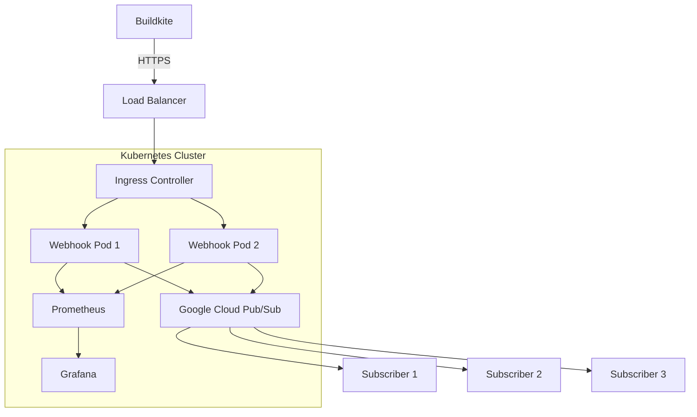
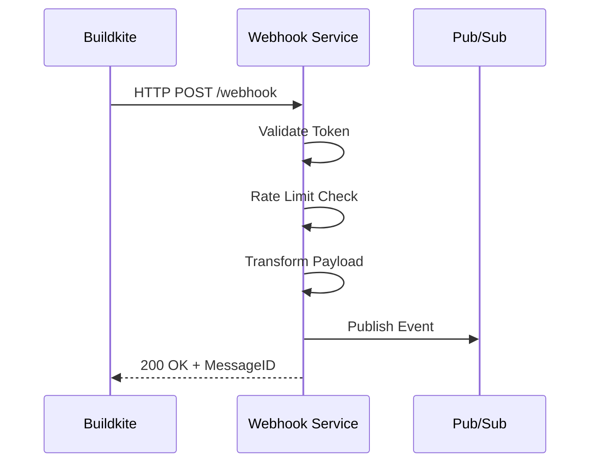
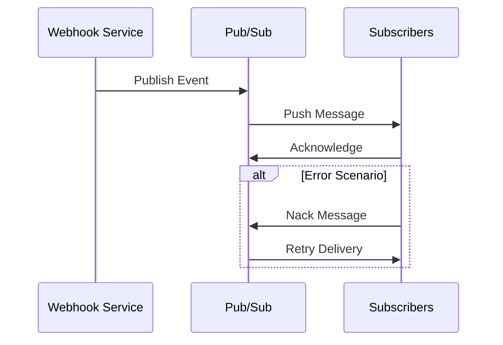
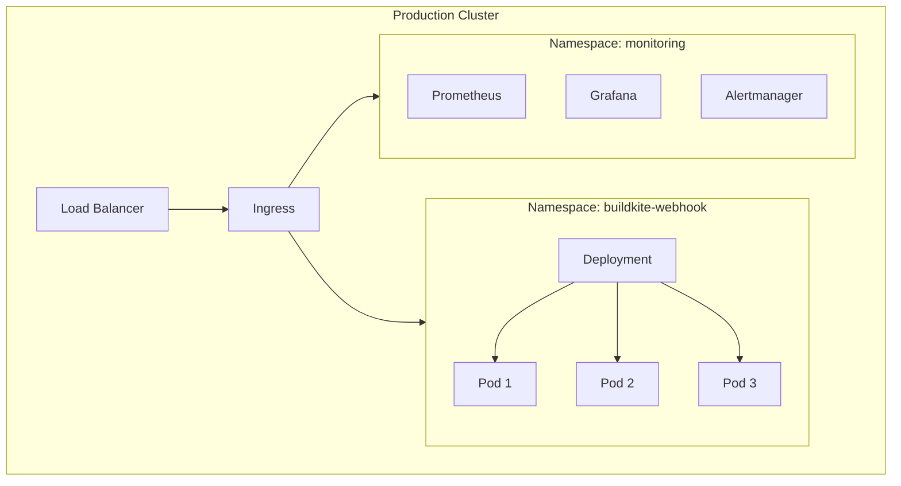

# Architecture Documentation

## System Overview

The Buildkite PubSub Webhook service is designed to reliably forward Buildkite webhook events to Google Cloud Pub/Sub while providing security, scalability, and observability. This document outlines the architectural decisions, components, and patterns used in the system.

## Architecture Diagram

## Core Components

### 1. Webhook Handler
- **Purpose**: Receives and validates Buildkite webhooks
- **Key Features**:
  - Token-based authentication
  - Request validation
  - Payload transformation
  - Event normalization
  - Pub/Sub message publishing

### 2. Security Layer
- **Components**:
  - Token validation
  - IP allowlist
  - Rate limiting (global and per-IP)
  - Security headers
  - TLS termination
- **Implementation**:
  - Middleware chain pattern
  - Configurable security policies
  - Automatic IP refresh from Buildkite API

### 3. Event Processing
- **Flow**:
  1. Webhook receipt
  2. Authentication & validation
  3. Payload transformation
  4. Pub/Sub publishing
- **Error Handling**:
  - Retries for transient failures
  - Dead letter queues
  - Error monitoring and alerting

### 4. Monitoring & Observability
- **Metrics**:
  - Request rates and latencies
  - Error rates
  - Authentication failures
  - Pub/Sub publish success/failure
  - Rate limit triggers
- **Visualization**:
  - Grafana dashboards
  - Prometheus metrics
  - Alert rules

## Design Decisions

### 1. Kubernetes Deployment
- **Why Kubernetes**:
  - Horizontal scaling
  - Self-healing
  - Rolling updates
  - Resource management
  - Service discovery
  - Load balancing

### 2. Event Transformation
- **Approach**: Transform Buildkite events into a normalized format
- **Benefits**:
  - Consistent schema
  - Simplified consumer processing
  - Version independence
  - Extended metadata

### 3. Security Architecture
- **Defense in Depth**:
  - Network security (ingress)
  - Application security (token validation)
  - Rate limiting
  - IP allowlisting
  - Security headers
  - TLS enforcement

### 4. Scalability Considerations
- **Horizontal Scaling**:
  - Stateless design
  - Distributed rate limiting
  - Connection pooling
  - Resource limits

### 5. Error Handling Strategy
- **Layers**:
  1. Application validation
  2. Publisher retries
  3. Dead letter queues
  4. Monitoring & alerting
- **Recovery**:
  - Automatic retries for transient failures
  - Manual intervention for persistent issues
  - Alert-based escalation

## Performance Considerations

### 1. Resource Management
- **CPU**:
  - Request handling
  - JSON parsing/transformation
  - TLS overhead
- **Memory**:
  - Connection pools
  - Request buffers
  - Rate limit tracking

### 2. Latency Optimization
- **Techniques**:
  - Connection reuse
  - Efficient JSON parsing
  - Minimal allocations
  - Pub/Sub batching
  - Timeout management

### 3. Capacity Planning
- **Metrics to Monitor**:
  - Requests per second
  - Response times
  - Error rates
  - Resource utilization
  - Network throughput

## Data Flow

### 1. Incoming Request Flow

### 2. Event Processing Flow

## Configuration Management

### 1. Environment Variables
- `PROJECT_ID`: Google Cloud project identifier
- `TOPIC_ID`: Pub/Sub topic name
- `BUILDKITE_WEBHOOK_TOKEN`: Authentication token
- `PORT`: HTTP server port

### 2. Kubernetes ConfigMaps
- Prometheus configuration
- Grafana dashboards
- Alert rules
- Security policies

### 3. Secrets Management
- Webhook tokens
- TLS certificates
- Service account credentials
- Grafana admin credentials

## Deployment Architecture

### 1. Production Environment

### 2. High Availability
- Multiple replicas
- Pod anti-affinity
- Node distribution
- Liveness/readiness probes
- Circuit breaking

## Integration Patterns

### 1. Subscriber Implementations
- Cloud Functions
- Cloud Run
- Kubernetes deployments
- External systems

### 2. Event Processing
- Filtering
- Transformation
- Aggregation
- Routing
- Storage

### 3. Common Use Cases
- Metrics collection
- Status updates
- Notifications
- Workflow triggers
- Audit logging

## Maintenance Procedures

### 1. Deployment
- Rolling updates
- Canary deployments
- Blue-green deployments
- Rollback procedures

### 2. Monitoring
- Metrics collection
- Log aggregation
- Alert management
- Performance tracking

### 3. Backup and Recovery
- Configuration backup
- Secret rotation
- Disaster recovery
- Incident response

## Security Considerations

### 1. Network Security
- TLS configuration
- Network policies
- Ingress rules
- Service mesh

### 2. Authentication & Authorization
- Token validation
- IP allowlisting
- Rate limiting
- Access controls

### 3. Data Protection
- Secret management
- Data encryption
- Audit logging
- Compliance requirements

## References

### 1. External Documentation
- [Buildkite Webhooks API](https://buildkite.com/docs/apis/webhooks)
- [Google Cloud Pub/Sub](https://cloud.google.com/pubsub/docs)
- [Kubernetes Best Practices](https://kubernetes.io/docs/concepts/configuration/overview/)

### 2. Internal Documentation
- [Quick Start Guide](./QUICK_START.md)
- [GCP Setup Guide](./GCP_SETUP.md)
- [Usage Guide](./USAGE.md)
- [Monitoring Guide](./MONITORING.md)
